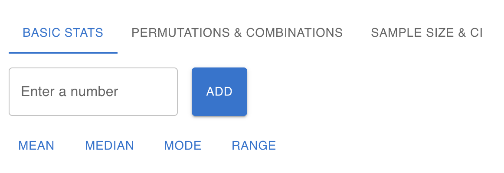
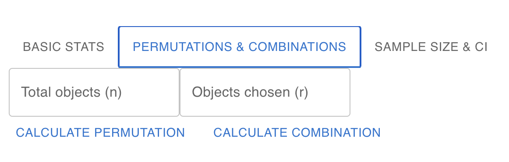
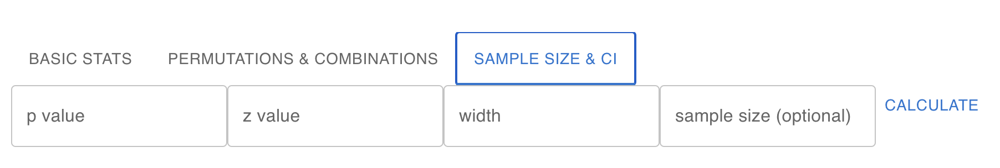

# Statistics Calculator
Functional calculator that solves a variety of statistics problems based on user preferences.

UI still needs some work though

## Basic Stats
- Mean
- Median
- Mode
- Range

## Combinatorics
- Permutations
- Combinations

## Confidence Intervals
- p-value
- z-value
- width
- sample size

